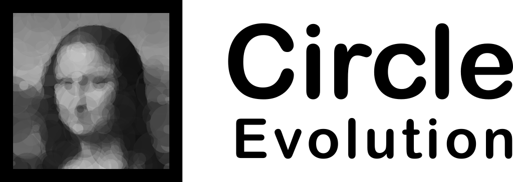

<p align="center">
    <br>
    
    <br>
<p>
<p align="center">
    <a href="#">
        
    </a>
    <a href="https://github.com/ahmedkhalf/Circle-Evolution/stargazers">
        
    </a>
    <a href="https://github.com/ahmedkhalf/Circle-Evolution/network/members">
        
    </a>
    <a href="https://github.com/ahmedkhalf/Circle-Evolution/blob/master/LICENSE">
        
    </a>
</p>
<h3 align="center">
Evolutionary Art Using Circles
</h3>

# Getting Started
## Installation

You can download the latest release using pip.
```bash
pip install circle-evolution
```

## Usage
### Command Line

You can easily start training an image by calling circle_evolution from your terminal

**Example:**
```bash
circle_evolution "Mona Lisa 64.jpg" --size 1 --genes 256 --max-generations 50000
```

| Parameter         | Description                                                          |
| ----------------- | -------------------------------------------------------------------- |
| --size            | Image size {1: (64, 64), 2: (128, 128), 3: (256, 256)}. *Default: 2* |
| --genes           | Number of circle to fit. *Default: 256*                              |
| --max-generations | Number of generations to run. *Default: 500,000*                     |

### Python Example Script

```python
from circle_evolution import evolution
from circle_evolution import helpers
import numpy as np
import cv2

target = helpers.load_target_image("Mona Lisa 64.jpg", size=(64, 64))
e = evolution.Evolution((64, 64), target, genes=256)

e.evolve(max_generation=50000)

helpers.show_image(e.specie.phenotype)

np.savetxt("Checkpoint.txt", e.specie.genotype)
cv2.imwrite("OuputImage.jpg", e.specie.phenotype)
```
# Contributing

Pull requests are welcome. For major changes, please open an issue first to discuss what you would like to change.

## Contributors

Ahmed Khalf
[ahmedkhalf](http://github.com/ahmedkhalf)

Guilherme de Amorim
[guimorg](http://github.com/guimorg)
